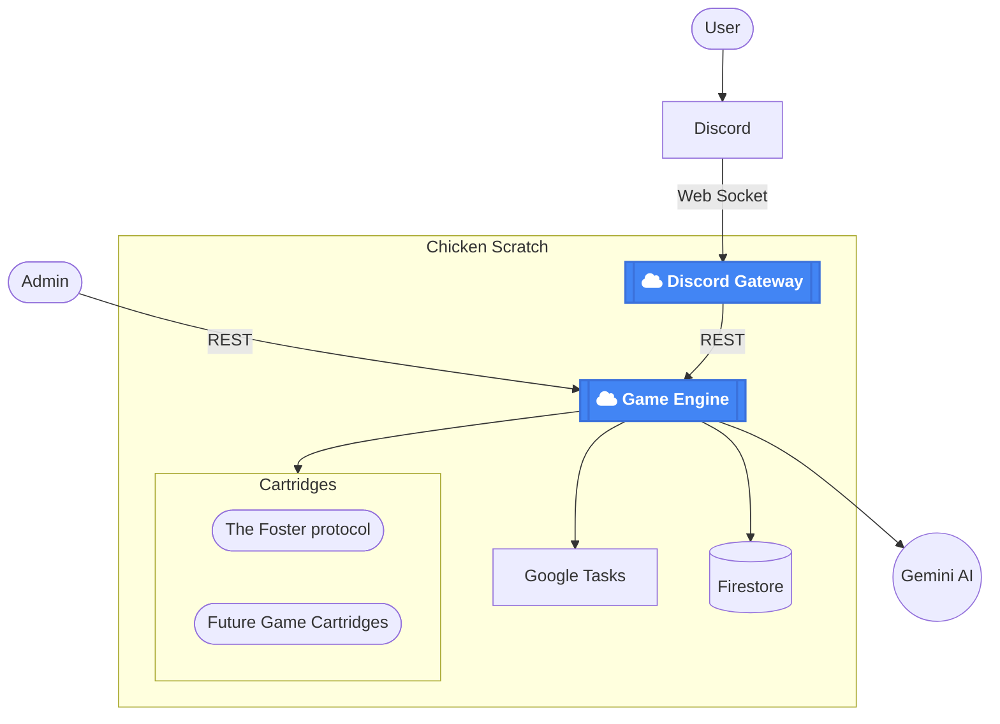

# The Foster Protocol
## Orchestrating AI agents with conflicting objectives

Consistency of terminology in prompts 
A single simple Discord gateway can handle extreme amounts of traffic before needing to scale. Separating the concerns allowefd for no more dropped messages. The gateway us always responsive to acknowledge messages as a single server the were problems with dropped and duplicate messages.

Prompt caching in Gemini means you can put in big system prompts to give depth

Tool design

Breaking up the day cycle into tasks

Create a diagram
Discord
My gateway my http server
Google tasks
Firestore

Concurrency from the ground up

Jinja2 templates because really we have 2 UIs

Include lessons learned for ai augmented development.
Don't let the ai run one it's own. Its indirect assumptions will compound and then you have a mess.
The best case scenario for ai is prototyping. That's where you'll move the fast and have the least consequences.
It doesn't like to change multiple files. So it's digits will be narrow and it won't address large issues. But given the prompt it can do a redesign.
Document things for both the AI and yourself
