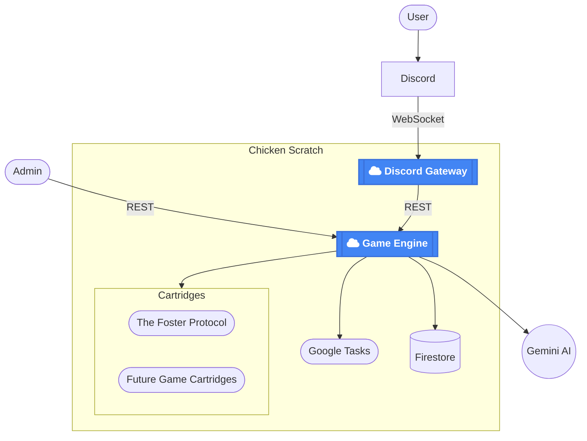

# The Foster Protocol
## Orchestrating AI agents with conflicting objectives

## Technical challenges
### Discord connection reliability
**Symptom**: Dropped messages and double procesing of messages during a deploy.  
**Underlying Issue**: Cloud run is driven by HTTP requests not websockets. Discord needs a single websocket connection for receiving messages.  
**Solution**: Separate a dedicated gateway to keep a single websocket connection to discord alive. The gateway's small profile reduces the need for deployment/downtime. And a single instance of this headless gateway on Cloud run should be able to serve a large volume of requests in a fire and forget fashion. The gateway should be moved to Kubernetes.

### Jinja2 for AI requests
**Symptom**: Difficult to edit and view AI requests.  
**Underlying Issue**: AI Agents needed to be treated as a different class of users needing their own Markdown UI. Strings and formatting for calling AI agents are scattered across the codebase inside python functions.  
**Solution**: All AI UI strings were moved to a central class for interacting with AI. This allowed for standardized system prompt that could be used in all calls to AI agents. Creating more consistent characters and behaviors. Jinja2 templates were introduced so that each call could be easily manipulated and viewed.

### Expensive AI calls
**Symptom**: High prices when calling AI.  
**Underlying Issue**: Nvidia Tax  
**Solution**: Utilize Gemini's prompt caching. Make a static lore bible of sufficient length. The AI was able to interact and speak with more depth and understanding. And  a sufficiently long and constant beginning of the system prompt triggers prompt caching by Gemini AI. The costs were reduced by 90%. A unit test was included to ensure that the beginning of the system prompt didn't accidentally become dynamic and break the cost reduction

### Long running Agent decision cycles
**Symptom**: AI calls were slow and one cycle of an 8 person game could take many minutes to complete. A deploy while a turn was processing could kill a game into an unrecoverable state.  
**Underlying Issue**: Cloud run is not designed for long running tasks.  
**Solution**: Utilize google tasks and also call the AI agents in parallel. The game system was updated to handle the sporadic replies of AI Agents in any order they were received. The persistence layer was updated to ensure no AI agent overwrote the actions of another. A night cycle in the game consists of 8 turns. Each turn was refactored to be a Google task and then each turn was run serially so that they could be processed one at a time to prevent long running requests in cloud run.